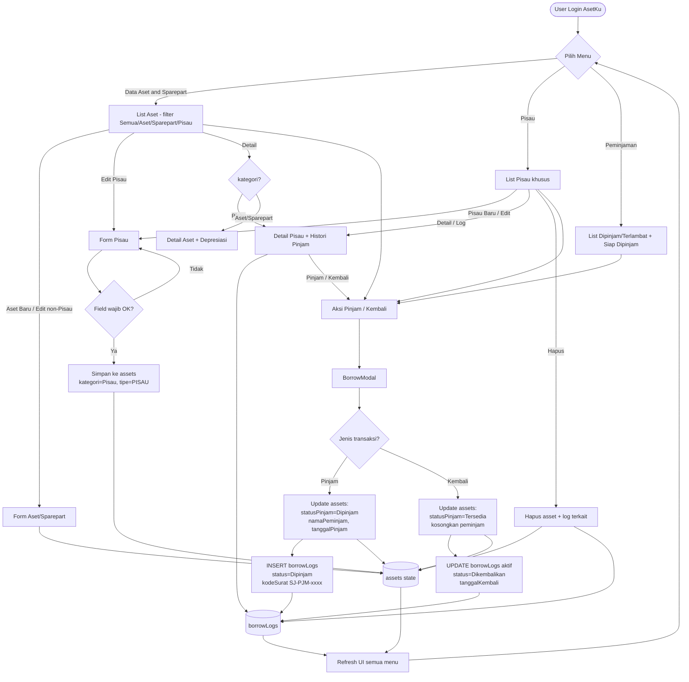
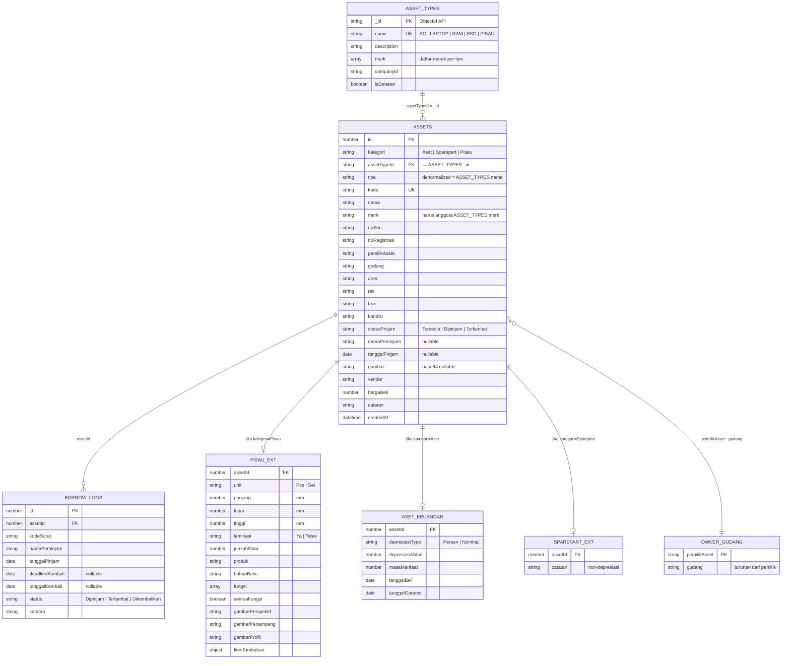
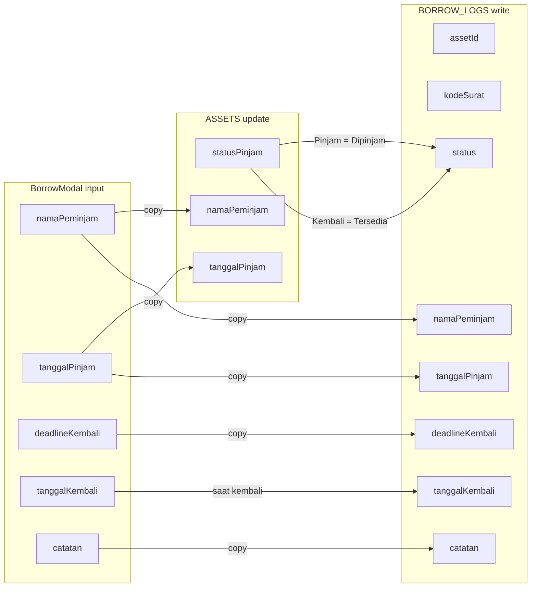
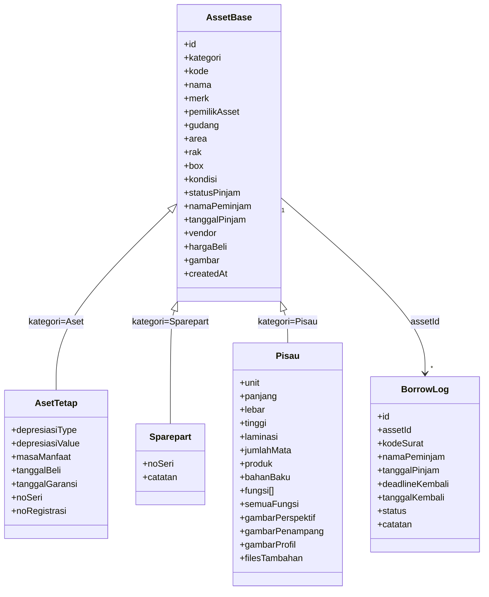

# AsetKu — Flowchart & Relasi Field

Dokumentasi alur bisnis dan model data modul Aset, Sparepart, dan Pisau dalam format Mermaid.

---

## 1. Flowchart alur bisnis (detail)

---

## 2. ER diagram + relasi field

---

## 3. Mapping field antar entitas (alur pinjam)

---

## 4. Inheritance kategori (satu tabel assets)

---

## 5. Ringkasan relasi

| Relasi | Kardinalitas | Kunci | Aturan |
|--------|--------------|-------|--------|
| `ASSET_TYPES` → `ASSETS` | 1 : N | `assets.assetTypeId = assetTypes._id` | Pilih tipe → cascade opsi `merk`; simpan `tipe` = `name` |
| `ASSETS` → `BORROW_LOGS` | 1 : N | `borrowLogs.assetId = assets.id` | Setiap pinjam INSERT; setiap kembali UPDATE log aktif |
| `pemilikAsset` → `gudang` | 1 : N | lookup `gudangOptionsByOwner` | Ganti pemilik → reset opsi gudang |
| `Pisau` ⊂ `ASSETS` | specialization | `kategori = 'Pisau'` + `assetTypeId` tipe PISAU | CRUD form khusus menu Pisau; mewarisi field ASSETS (+ ASET_KEUANGAN jika peran Aset); field PISAU_EXT tidak masuk form Aset |
| Menu Aset / Pisau / Peminjaman | share store | state `assets` + `borrowLogs` | Satu sumber kebenaran di App |

---

## 6. Tabel field lengkap

### ASSETS (field bersama)

| Field | Tipe | Wajib | Keterangan |
|-------|------|-------|------------|
| id | number | Ya | Primary key |
| kategori | string | Ya | `Aset` / `Sparepart` / `Pisau` |
| assetTypeId | string | Ya | FK → master tipe (`_id` dari API) |
| tipe | string | Ya | Denormalized dari `ASSET_TYPES.name` (LAPTOP, PISAU, …) |
| kode | string | Ya | Unique code |
| nama | string | Ya | Nama item |
| merk | string | Ya* | Anggota array `merk[]` pada tipe yang dipilih |
| noSeri | string | Kondisional | Wajib untuk Aset/Sparepart |
| noRegistrasi | string | Kondisional | Bagian kode registrasi |
| pemilikAsset | string | Ya | Internal Wajib / TKI / FTP |
| gudang | string | Ya | Bergantung pemilikAsset |
| area | string | Tidak | Area lokasi |
| rak | string | Tidak | No rak |
| box | string | Tidak | No box |
| kondisi | string | Ya | Kondisi Baik, Rusak, dll |
| statusPinjam | string | Ya | Tersedia / Dipinjam / Terlambat |
| namaPeminjam | string | Tidak | Null jika tersedia |
| tanggalPinjam | date | Tidak | Null jika tersedia |
| gambar | string | Tidak | Base64 preview |
| vendor | string | Tidak | Nama/kode vendor |
| hargaBeli | number | Tidak | IDR |
| catatan | string | Tidak | Catatan bebas |
| createdAt | datetime | Ya | Waktu dibuat |

### ASSET_TYPES (master tipe — respons API inventori)

| Field | Tipe | Wajib | Keterangan |
|-------|------|-------|------------|
| _id | string | Ya | Primary key API |
| name | string | Ya | Nama tipe: AC, LAPTOP, RAM, SSD, PISAU |
| description | string | Tidak | Deskripsi tipe |
| merk | string[] | Ya | Daftar merek valid untuk tipe ini |
| companyId | string | Ya | Scope perusahaan |
| isDeleted | boolean | Ya | Soft delete |

### PISAU_EXT (field khusus kategori Pisau)

| Field | Tipe | Wajib | Keterangan |
|-------|------|-------|------------|
| unit | string | Ya | Pcs / Set |
| panjang | number | Ya | mm |
| lebar | number | Ya | mm |
| tinggi | number | Ya | mm |
| laminasi | string | Ya | Ya / Tidak |
| jumlahMata | number | Ya | Jumlah mata pisau |
| produk | string | Tidak | Solid Wood, MDF, dll |
| bahanBaku | string | Tidak | HSS, Carbide, dll |
| fungsi | string[] | Ya* | Multi-tag fungsi |
| semuaFungsi | boolean | Tidak | Jika true = semua opsi |
| peranInventori | string | Ya | `Aset` / `Part` / `Keduanya` |
| fotoUtama | string | Tidak | Base64 |
| gambarHasil | string | Tidak | Base64 |
| gambarPerspektif | string | Tidak | Base64 |
| gambarPenampang | string | Tidak | Base64 |
| gambarProfil | string | Tidak | Base64 |
| filesTambahan | object | Tidak | Map kategori → file[] |

**Paritas field Aset → Pisau:** record `kategori=Pisau` mewarisi seluruh field bersama `ASSETS` (`noSeri`, `noRegistrasi`, `kondisi`, `catatan`, `vendor`, `hargaBeli`, lokasi, pinjam, dll.) serta field `ASET_KEUANGAN` ketika `peranInventori` = `Aset` atau `Keduanya`. Field khusus Pisau di atas **tidak** ditambahkan ke form/modul Aset biasa.

### ASET_KEUANGAN (field khusus kategori Aset / Pisau-as-Aset)

| Field | Tipe | Wajib | Keterangan |
|-------|------|-------|------------|
| depresiasiType | string | Tidak | Persen / Nominal |
| depresiasiValue | number | Tidak | Nilai depresiasi |
| masaManfaat | number | Tidak | Tahun |
| tanggalBeli | date | Tidak | Tanggal pembelian |
| tanggalGaransi | date | Tidak | Masa garansi |

### BORROW_LOGS

| Field | Tipe | Wajib | Keterangan |
|-------|------|-------|------------|
| id | number | Ya | Primary key |
| assetId | number | Ya | FK → assets.id |
| kodeSurat | string | Ya | Contoh: SJ-PJM-0102 |
| namaPeminjam | string | Ya | Nama peminjam |
| tanggalPinjam | date | Ya | Tanggal dipinjam |
| deadlineKembali | date | Tidak | Perkiraan kembali |
| tanggalKembali | date | Tidak | Diisi saat kembali |
| status | string | Ya | Dipinjam / Terlambat / Dikembalikan |
| catatan | string | Tidak | Catatan transaksi |

---

*Sumber: implementasi `src/App.jsx`, `src/data/mockData.js`, `src/components/PisauView.jsx`*
