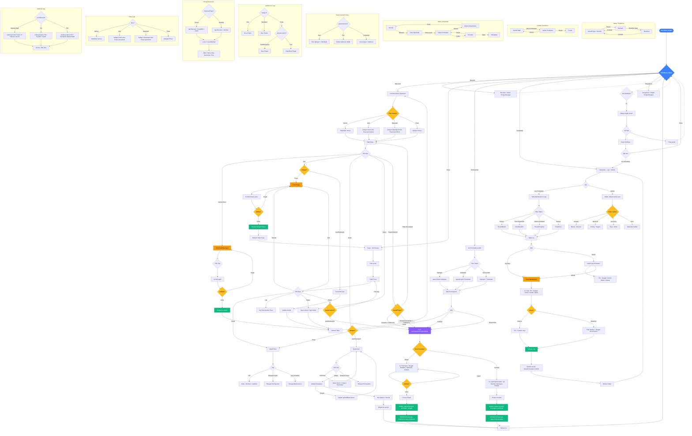

# AsetKu — Full Flowchart Semua Kondisi

```mermaid
flowchart TD
  Start([User Buka AsetKu]) --> MainNav{Pilih Menu Utama}

  %% ===== NAVIGASI =====
  MainNav -->|Beranda| Beranda[Beranda - Dalam Pengembangan]
  MainNav -->|Data Aset| AsetList
  MainNav -->|Pisau| PisauList
  MainNav -->|Peminjaman| PinjamList
  MainNav -->|Perawatan| MaintenanceList
  MainNav -->|Pengaturan| Pengaturan[Pengaturan - Dalam Pengembangan]

  %% ===== NOTIFIKASI =====
  MainNav -.-> NotifCheck{Ada Notifikasi?}
  NotifCheck -->|Ya| NotifBadge[Badge angka merah]
  NotifBadge --> KlikNotif{Klik bell}
  KlikNotif --> NotifPanel[Panel Notifikasi]
  KlikNotif --> TidakNotif[Tutup panel]
  TidakNotif -.-> MainNav
  NotifPanel --> KlikItemNotif{Klik item}
  KlikItemNotif -->|Ke Perawatan| MaintenanceList
  KlikItemNotif -->|Tutup| MainNav

  %% ===== DATA ASET =====
  AsetList[List Data Aset & Sparepart]
  AsetList --> FilterKategori{Filter Kategori}
  FilterKategori -->|Semua| ShowAll[Tampilkan semua]
  FilterKategori -->|Aset| ShowAset[kategori=Aset atau Pisau+peranAset]
  FilterKategori -->|Sparepart| ShowPart[kategori=Sparepart atau Pisau+peranPart]
  FilterKategori -->|Pisau| ShowPisau[kategori=Pisau]

  ShowAll --> AsetTable[Tabel Data]
  ShowAset --> AsetTable
  ShowPart --> AsetTable
  ShowPisau --> AsetTable

  AsetTable --> AsetAction{Pilih Aksi}

  %% --- Tambah Aset ---
  AsetAction -->|Tambah Baru| AsetForm[Form Aset/Sparepart]
  AsetForm --> PilihTipeAset{Pilih Tipe}
  PilihTipeAset --> AsetFields[Isi field wajib]
  AsetFields --> ValAset{Validasi?}
  ValAset -->|Gagal| AsetForm
  ValAset -->|Lolos| SaveAset[Simpan ke assets]
  SaveAset --> RefreshAset[Refresh Tabel]
  RefreshAset --> AsetList

  %% --- Edit Aset ---
  AsetAction -->|Edit| CheckKatEdit{kategori?}
  CheckKatEdit -->|Pisau| PisauForm
  CheckKatEdit -->|Aset/Sparepart| AsetFormEdit[Form Edit Aset]
  AsetFormEdit --> SaveAsetEdit[Update assets]
  SaveAsetEdit --> RefreshAset

  %% --- Detail Aset ---
  AsetAction -->|Detail| CheckKatDetail{kategori?}
  CheckKatDetail -->|Pisau| PisauDetail
  CheckKatDetail -->|Aset/Sparepart| AsetDetail[Detail Aset]
  AsetDetail --> DetailTab{Pilih Tab}
  DetailTab -->|Informasi| InfoAset[Data Umum + Lokasi + Depresiasi]
  DetailTab -->|Jadwal| JadwalTab[Jadwal Perawatan]
  DetailTab -->|Riwayat Pinjam| RiwayatPinjam[Riwayat Peminjaman]
  InfoAset --> AsetDetail
  JadwalTab -->|Simpan| UpdateJadwal[Update jadwalMaintenance]
  UpdateJadwal --> AsetDetail

  %% --- Hapus ---
  AsetAction -->|Hapus| DelAsset[Hapus asset + logs terkait]
  DelAsset --> RefreshAset

  %% --- Pinjam/Kembali dari tabel ---
  AsetAction -->|Pinjam/Kembali| CheckPinjam{statusPinjam?}
  CheckPinjam -->|Tersedia + canBorrow| BorrowModal
  CheckPinjam -->|Dipinjam/Terlambat + canBorrow| BorrowModal
  CheckPinjam -->|Tidak bisa pinjam| AsetTable

  %% ===== PISAU =====
  PisauList[Pisau - List Khusus]
  PisauList --> PisauFilter[Filter peran]
  PisauFilter --> PisauTable[Tabel Pisau]
  PisauTable --> PisauAction{Pilih Aksi}

  PisauAction -->|Tambah| PisauForm
  PisauForm[Form Pisau] --> PisauFields[Isi field khusus pisau]
  PisauFields --> ValPisau{Validasi?}
  ValPisau -->|Gagal| PisauForm
  ValPisau -->|Lolos| SavePisau[Simpan kategori=Pisau]
  SavePisau --> RefreshPisau[Refresh Tabel Pisau]
  RefreshPisau --> PisauList

  PisauAction -->|Edit| PisauForm
  PisauAction -->|Detail| PisauDetail
  PisauDetail[Detail Pisau] --> PisauDetailTab{Tab}
  PisauDetailTab -->|Info| InfoPisau[Data + Dimensi + Gambar]
  PisauDetailTab -->|Riwayat Pinjam| RiwayatPinjamPisau[Riwayat Peminjaman]
  PisauDetailTab -->|Log Perbaikan| LogPerbaikan[Riwayat Maintenance]

  PisauAction -->|Log| PisauLog[Log Peminjaman Pisau]
  PisauAction -->|Hapus| DelAsset
  PisauAction -->|Pinjam| CheckPinjamPisau{peranInventori?}
  CheckPinjamPisau -->|Aset/Keduanya| BorrowModal
  CheckPinjamPisau -->|Part saja| PisauTable

  %% ===== PEMINJAMAN =====
  PinjamList[List Peminjaman Aktif]
  PinjamList --> FilterPinjam{Filter Status}
  FilterPinjam -->|Dipinjam| ShowDipinjam[statusPinjam=Dipinjam]
  FilterPinjam -->|Terlambat| ShowTerlambat[statusPinjam=Terlambat]
  FilterPinjam -->|Semua Aktif| ShowAllPinjam[Dipinjam + Terlambat]
  ShowDipinjam --> PinjamTable[Tabel Peminjaman]
  ShowTerlambat --> PinjamTable
  ShowAllPinjam --> PinjamTable
  PinjamTable --> PinjamAction{Aksi}
  PinjamAction -->|Detail| CheckKatDetail
  PinjamAction -->|Kembali| BorrowModal
  PinjamAction -->|Pinjam Baru| BorrowModal

  %% ===== FORM PEMINJAMAN =====
  BorrowModal[Form Peminjaman/Pengembalian]
  BorrowModal --> TxType{Jenis Transaksi?}

  TxType -->|Pinjam| InputPinjam[Isi: Peminjam, Tanggal, Deadline, Sparepart, Catatan]
  InputPinjam --> ValPinjam{Validasi?}
  ValPinjam -->|Gagal| InputPinjam
  ValPinjam -->|Lolos| ProsesPinjam[Proses Pinjam]
  ProsesPinjam --> SetDipinjam[Update: status=Dipinjam, peminjam, tanggal]
  SetDipinjam --> InsertLog[INSERT borrowLogs: kodeSurat, status=Dipinjam]
  InsertLog --> RefreshAll[Refresh UI]
  RefreshAll --> MainNav

  TxType -->|Kembali| InputReturn[Isi: Tgl Pinjam koreksi, Tgl Kembali, Sparepart, Catatan]
  InputReturn --> ProsesReturn[Proses Kembali]
  ProsesReturn --> SetTersedia[Update: status=Tersedia, kosongkan peminjam]
  SetTersedia --> CloseLog[UPDATE borrowLogs: status=Dikembalikan]
  CloseLog --> RefreshAll

  %% ===== PERAWATAN =====
  MaintenanceList[Perawatan - Log + Jadwal]
  MaintenanceList --> MaintTab{Tab}
  MaintTab -->|Log Perawatan| MaintLog[Tabel Maintenance Logs]
  MaintTab -->|Jadwal| JadwalList[Daftar Jadwal semua aset]

  MaintLog --> FilterMaint{Filter Status}
  FilterMaint -->|Semua| ShowAllMaint
  FilterMaint -->|Perlu Diperbaiki| ShowNeedFix
  FilterMaint -->|Dalam Perbaikan| ShowInProgress
  FilterMaint -->|Selesai| ShowDone
  ShowAllMaint --> MaintTable[Tabel Log]
  ShowNeedFix --> MaintTable
  ShowInProgress --> MaintTable
  ShowDone --> MaintTable

  JadwalList --> CheckJadwal{Status Jadwal}
  CheckJadwal -->|overdue| JadwalOverdue[Merah - Terlewat]
  CheckJadwal -->|dueSoon| JadwalSoon[Kuning - Segera]
  CheckJadwal -->|upcoming| JadwalOK[Hijau - Aman]
  CheckJadwal -->|none| JadwalNone[Tidak Ada Jadwal]

  MaintTable --> MaintAction{Aksi}
  MaintAction -->|Log Baru| MaintenanceForm
  MaintAction -->|Detail| MaintenanceLogDetail
  MaintenanceLogDetail[Detail Log Perawatan] --> LogInfo[PIC, Tanggal, Vendor, Status, Catatan]
  MaintenanceLogDetail -->|Update| MaintenanceForm

  MaintenanceForm[Form Maintenance] --> InputMaint[Isi: Aset, PIC, Tanggal, Lokasi, Vendor, Status]
  InputMaint --> CheckLokasi{Lokasi?}
  CheckLokasi -->|Internal| InternalFields[PIC + Catatan saja]
  CheckLokasi -->|Eksternal| VendorFields[Pilih Vendor + Tanggal Kirim/Terima]
  InternalFields --> SaveMaint
  VendorFields --> SaveMaint
  SaveMaint[Simpan Log] --> UpdateAssetMaint[Update assets: statusPerawatan, kondisi]
  UpdateAssetMaint --> RefreshMaint[Refresh Tabel]
  RefreshMaint --> MaintenanceList

  JadwalTab --> AturJadwal[Atur jadwal + interval]
  AturJadwal --> SimpanJadwal[Simpan ke assets]
  SimpanJadwal --> RefreshAll

  %% ===== SUBGRAPH: STATUS TRANSITIONS =====
  subgraph StatusFlow[Status Transitions]
    direction LR
    SA[statusPinjam: Tersedia] -->|Pinjam| SB[Dipinjam]
    SB -->|Kembali| SA
    SB -->|Deadline lewat| SC[Terlambat]
    SC -->|Kembali| SA
  end

  %% ===== SUBGRAPH: KONDISI =====
  subgraph KondisiFlow[Kondisi Transitions]
    direction LR
    KA[Kondisi Baik] -->|Dalam Perbaikan| KB[Dalam Perbaikan]
    KB -->|Selesai| KA
    KB -->|Rusak| KC[Rusak]
  end

  %% ===== SUBGRAPH: STATUS PERAWATAN =====
  subgraph MaintFlow[Status Perawatan]
    direction LR
    MA[Normal] -->|Masalah| MB[Perlu Diperbaiki]
    MB -->|Mulai repair| MC[Dalam Perbaikan]
    MC -->|Selesai| MD[Selesai Diperbaikan]
    MD -->|Reset| MA
    MC -->|Tunda| ME[Tertunda]
    ME -->|Lanjut| MC
    ME -->|Batal| MF[Dibatalkan]
  end

  %% ===== SUBGRAPH: PERAN PISAU =====
  subgraph PisauRoles[Peran Inventori Pisau]
    direction TB
    PR{peranInventori?}
    PR -->|Aset| PA[Bisa dipinjam + diperbaiki]
    PR -->|Part| PP[Bahan kalkulasi / BOM]
    PR -->|Keduanya| PK[Bisa pinjam + kalkulasi]
  end

  %% ===== SUBGRAPH: CAN BORROW =====
  subgraph BorrowLogic[canBorrow Logic]
    direction TB
    CB{kategori?}
    CB -->|Aset| CanYes[Bisa Pinjam]
    CB -->|Sparepart| CanYes2[Bisa Pinjam]
    CB -->|Pisau| CB2{peranInventori?}
    CB2 -->|Aset/Keduanya| CanYes3[Bisa Pinjam]
    CB2 -->|Part| CanNo[Tidak Bisa Pinjam]
  end

  %% ===== SUBGRAPH: DEPRESIASI =====
  subgraph Depresiasi[Hitung Depresiasi]
    direction TB
    DD{depresiasiType?}
    DD -->|Persen| DP[depTahunan = hargaBeli x nilai%]
    DD -->|Nominal| DN[depTahunan = nilai flat]
    DP --> DTable[Loop 1..masaManfaat]
    DN --> DTable
    DTable --> DResult[Tabel: Tahun, Dep, Akumulasi, Sisa]
  end

  %% ===== SUBGRAPH: FILTER =====
  subgraph FilterLogic[Filter Logic]
    direction TB
    FL{filter?}
    FL -->|Semua| FLA[Tampilkan semua]
    FL -->|Aset| FLB[kategori=Aset atau Pisau+peranAset]
    FL -->|Sparepart| FLC[kategori=Sparepart atau Pisau+peranPart]
    FL -->|Pisau| FLD[kategori=Pisau]
  end

  %% ===== SUBGRAPH: GUDANG =====
  subgraph GudangLogic[Gudang Logic]
    direction TB
    GL{pemilikAsset?}
    GL -->|Internal Wajib| GH1[Gudang Kantor Pusat / IT Internal / Umum]
    GL -->|TKI| GH2[Gudang Utama TKI / Logistik / Transit]
    GL -->|FTP| GH3[Gudang Utama FTP / Sparepart / Bahan Baku]
    GH1 --> GL2[Isi Area, Rak, Box]
    GH2 --> GL2
    GH3 --> GL2
  end

  Beranda -.-> MainNav
  Pengaturan -.-> MainNav

  classDef menu fill:#3b82f6,stroke:#1e40af,color:#fff,font-weight:bold
  classDef form fill:#f59e0b,stroke:#d97706,color:#000
  classDef action fill:#10b981,stroke:#059669,color:#fff
  classDef modal fill:#8b5cf6,stroke:#6d28d9,color:#fff
  classDef decision fill:#fbbf24,stroke:#f59e06,color:#000

  class Start,MainNav menu
  class AsetForm,PisauForm,BorrowModal,MaintenanceForm form
  class SaveAset,SavePisau,InsertLog,CloseLog,SetDipinjam,SetTersedia,SaveMaint action
  class BorrowModal modal
  class FilterKategori,TxType,CheckKatEdit,CheckKatDetail,ValAset,ValPisau,ValPinjam,CheckLokasi,CheckJadwal,CheckPinjam,CheckPinjamPisau decision
```
