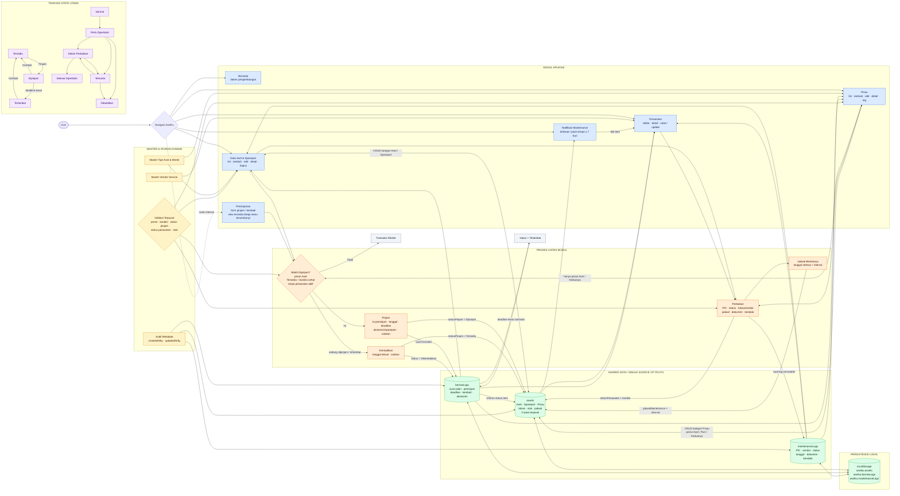

# Flowchart Data Antar Modul AsetKu — Satu Halaman

Diagram ini menunjukkan modul UI, proses bisnis, data bersama, dan dampak perubahan data dalam satu halaman penuh.

Catatan: `kondisi`, `statusPinjam`, dan `statusPerawatan` tetap tiga state berbeda. Sparepart biasa hanya menjadi stok/aksesoris transaksi, bukan item pinjaman utama.
